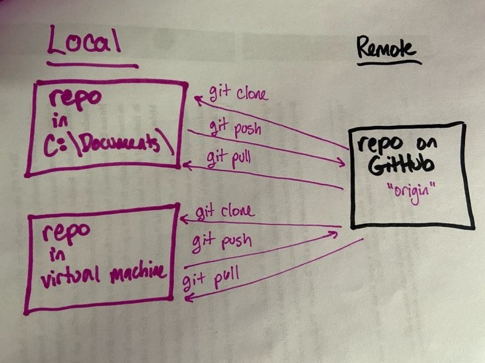
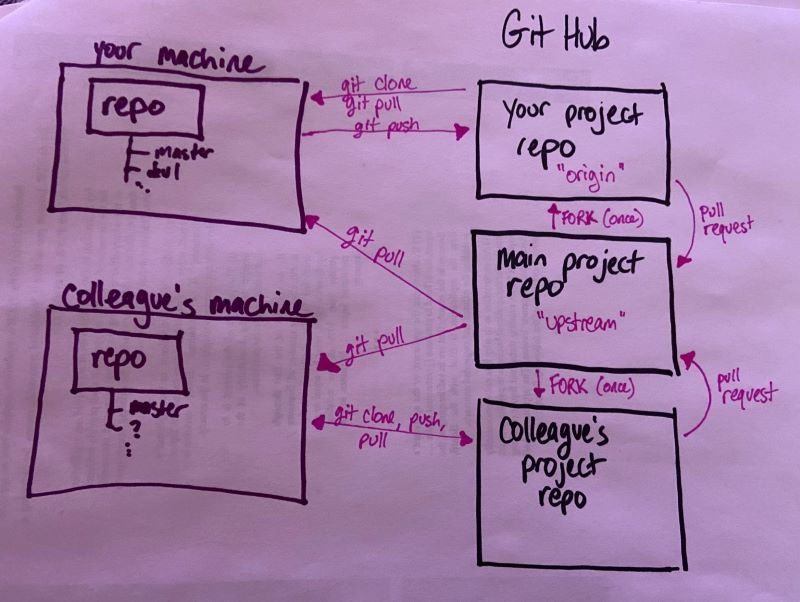

# How to GitHub, Part 1

Agenda:
1. [First steps](#first_steps)
1. [One person, one repo, multiple machines (or directories), not worrying about branches yet](#simple)
1. [One person, one repo, multiple branches](#branches)
1. [Multiple repositories, multiple people](#remotes)
1. [About .gitignore](#gitignore)
1. [Miscellaneous notes](#misc)

## A couple of first steps

1. Make sure you have an account on [GitHub](https://github.com) and that you know how to log in to it.
1. Make sure you have Git and a Linux-style command line:
* If you're on Windows, get a copy of [Git Bash](https://git-scm.com/downloads) for yourself. 
* If you're on a Mac, you can use Terminal, and you probably already have git. We can talk through how to get you onto a newer and better version than the default Apple one, but that'll work for tonight. 
* On Ubuntu Linux (including CCAC's virtual machines), it's two commands in the command line interface:
	* sudo apt-get update 
	* sudo apt-get install git

We'll break this down into a different scenarios/levels of complexity. (Go in order.)

## One person, one repo, multiple machines (or directories), not worrying about branches yet

**[First video](./media/github1.mp4)** - shows how to create a repository on GitHub, clone it to your local machine, make changes, and push those changes back up to the remote repo

1. Log in to your own GitHub account, on github.com, and create a new repository. For our purposes, let's call it `github_practice`. Check the box to "Initialize this repository with a README". (You'll be able to delete this after we're done tonight if you want!)
1. In Git Bash, navigate to a directory where it makes sense to have some GitHub repositories. My suggested command on Windows:
	* `cd /c/Users/[username]/Documents` - I created two folders inside Documents:
		* `mkdir machine1`
		* `mkdir machine2`
1. Clone your repository to your machine. The command you'll type (type all of it except the URL, don't just copy/paste) in Git Bash is
	* `git clone https://github.com/[username]/github_practice.git`
	* this will make a directory inside your current working directory; to do anything else, you'll have to navigate into that directory (`cd github_practice`) 
1. Open the README in whatever editor you like, and change it. Give it a friendlier title than the repository name, and feel free to add other text if you like. For future reference, [this is the Markdown cheat sheet I like to use](https://github.com/adam-p/markdown-here/wiki/Markdown-Cheatsheet). Save your file when you're finished.
1. Go back to Git Bash, and check the status of your repository.
	* `git status`
	* there should be at least one file that needs to be added
1. Add the file you want to track, in this case, README.md.
	* `git add README.md`
	* this isn't best practice, but you'll often see me use `git add *` which adds EVERYTHING - I kind of make up for it by typing `git status` all the time, so I do always know what I'm adding
1. Commit your changes.
	* `git commit -m "Added some text to README"` 
	* your commit message (the part in quotes) can be anything, including a set of emojis; if you're GitHubbing alone, you can do what you want, but if you're working with others, it's best to use the commit message to communicate what actually changed
	* if you leave off the -m tag, you can leave a much longer commit message, in whatever editor is the default for the bash shell you're using
1. Push your changes up from your local repo to the repo on the cloud (in GitHub).
	* `git push origin master` 
	* this is the default incantation for pushing to a remote repository, but we'll learn how and when it will change in a few minutes
	* `origin` is the identifier of the remote repository
	* `master` is the name of the branch you're working on
1. Feel free to go see the changes in GitHub.

**[Second video](./media/github2.mp4)** - how to move between "machines" (we are using directories, here; when this lesson is done in person, I actually make you move to a different machine, and it's very dramatic), using git push and git pull to keep them both up to date with your remote repository

1. Now **change directories.** If you started in the `machine1` directory, use `cd` in Git Bash to move to the `machine2` directory.
1. Clone the repository from GitHub on the "new machine" (trust me that this works the same across multiple machines as it works across multiple directories), and navigate into the directory housing your local repo in the second directory.
1. Create a file; you can do this directly from Git Bash by typing `touch trashfile.txt`
1. Add the file to the files tracked on Git, commit your changes, and push. 
1. Go back to your first machine. (Leave the new machine logged in; you'll be back.) Check the status of the repository with `git status` - oh no, you're behind by one commit! 
	* `git pull origin master`
	* now you have pulled the changes from the remote repository to your local one - if you go look, your new file is in that directory!
1. Practice making changes and swapping machines a couple more times, to really hammer that skill in

## One person, one repo, multiple branches

You might recall from the [optional reading](https://nvie.com/posts/a-successful-git-branching-model/) (which I don't think I formally assigned you, so... you might find out if you go read it now) that sometimes&mdash;especially when we're working on a multi-person team, but even sometimes when we're working alone&mdash;we want to work on more than one feature at once, without any risk that we damage our core (hopefully fully tested) functionality. We can segment our work by using branches.

**[Video about branching](./media/github3.mp4)**

1.  Make sure you've got everything pulled onto your local repository from your remote repository (on GitHub) with another `git status` and/or `git pull origin master`
1. We only have one branch, named `master` right now. Prove it to ourselves:
	* `git branch`
1. Let's make another, named `feature1` (feature one, not feature L)
	* `git branch feature1`
1. Let's see which branch we're currently on (yes, Git Bash helps us out with this, but go ahead and check anyway)
	* `git branch`
1. OK, we're still on `master`, no big deal, but let's go ahead and get on our feature branch
	* `git checkout feature1`
1. Make a change. In fact, go ahead and add a whole new file, to make it easy to see where which changes are sitting. 
1. Add the file to be tracked, and commit it just like you normally would. 
1. The thing that changes is our push statement:
	* `git add origin feature1`
1. Now go look at the repository in GitHub. Whoa, branches!
1. OK, now go switch directories again. Now you need to get access to the remote's branches on this "other machine," right?
	* `git fetch --all`
1. Now your machine at least knows about the other branch(es), though if you type `git branch` you probably still only have `master` on this machine. So let's check out our feature branch:
	* `git checkout feature`
	* now you should get a message like "Branch 'feature1' set up to track remote branch 'feature1' from 'origin'."
	* this next bit is probably unnecessary (it was for me when I tested it), but just in case...
	* `git pull origin feature1`
1. Make a change (add another file, edit a file, I don't care). 
1. Add, commit, and push -- what is our incantation for this push? (Try to figure it out, but the video says what it is, too.)
1. Go back to your other machine. What is the incantation to pull the changes down to your local repo?
1. A thing I'd like you to try: switch branches, and go look at your files in File Explorer/Manager (you might have to refresh your view). Are they different when you're on a different branch? How do you feel about that?
1. Now, you *could* use [git merge](https://www.atlassian.com/git/tutorials/using-branches/git-merge) to merge your branches, and that's totally OK. But that isn't what Eric had you do in [week 6 of Python 2](https://technologyrediscovery.net/python/cit129_courseCalendar_sp20_fresh.html), so it's not what I'm going to have you do this time. We'll do this in his (equally good) way and do a Pull Request.
1. Go to the repository on GitHub. You'll be offered the option to make a Pull Request. Do it. Since you are the owner of the repository, you'll also be able to merge the pull request (a second button). Do that too.
1. Once `feature1` has been merged into `master`, you can pull the changes onto your local master branch (on either machine):
	* `git checkout master`
	* `git pull origin master` - this grabs the changes to the master branch after your pull request on the cloud
	* `git branch -d feature1` - this removes the feature1 branch
1. Practice this a little more. Try out some things, see how they work. Ask questions in Slack.

## Multiple repositories, multiple people

The model used in DAT-129 (in the week 6 link above), where you're added as a collaborator on someone else's repository, is good to use and to know about when the circumstances call for it. We are _not_ going to reproduce that model here, because there's another model you'll also need practice with: often, you will not be added as a collaborator, with all of the rights that entails, but you nonetheless have helpful changes to make.

We're going to switch repositories now. 

Here is our model:

And **[here is the video](./media/github4.mp4)**

1. `cd` back up to the parent directory so that you aren't making a Git repo inside a Git repo (which is a surefire way to make yourself very unhappy). 
1. Go to [our datasets repository](https://github.com/ccac-data-analytics/datasets) and **do not clone it.**
1. You're going to fork it to your own account. There's a button for that at the top right (way higher than the clone button).
1. Then you're going to clone it **from your copy of the repository.** 
1. Navigate into the directory it just created. Let's see what remotes we have.
	* `git remote -v`
1. OK, nothing new so far, right? We have one remote, called "origin," which sits on our own GitHub account. Great!
1. Now we're going to add another remote, so that we're able to pull down changes when they happen on the repository we forked from. We're going to name it `upstream` (this is convention, not a hard and fast rule).
	* 'git remote add upstream https://github.com/ccac-data-analytics/datasets.git'
1. If we do `git remote -v` again, we can see we have two remotes, now: origin and upstream.
1. Now, I'm going to make a change to our upstream repo, so you can all pull them down and push them to your own repos. (**Don't type the next few things you see me typing**, OK?)
1. I made changes on the ccac-data-analytics copy of the repository (on the master branch). To pull them down to your **local** repository, you'll type this:
	* `git pull upstream master`
1. To push them to **your own remote repository** you'll type this:
	* `git push origin master`
1. OK, now you know how to keep your local repository up to date with someone else's repo that you have no control over. That's powerful! There's a lot you can do with just that&mdash;maybe you have your own fork of an open source project, but you want to keep it up to date with what the community is doing. Valid! Useful! 

But now, let's say you make a change that you want reflected in the main repository. You've got a really good bugfix or cool new feature or something, right? Great!

You need to make the changes on your local repo and then issue a pull request to the main repository, since you don't have the rights to push to it directly. 

One by one, we are going to go through this. I'll walk you each through it if you want. But you need to wait your turn&mdash;**don't** do this next bit until I tell you, individually, to do so. **Email me when you're ready, and I'll email you when it's your turn.**
1. First, you need to pull down any changes from upstream. 
1. Now, make a change (add or edit a file, or multiple files!) on your local machine. **I would really like you to add something good! Go find a project in our shared directory that is begging to have more work done it, or add a link to a data source you've found useful. Add an idea you have for a cool project that you want to do in the future.**
1. Push the changes to **your** remote. (Remember to navigate back up a directory before adding and committing, if you're in a subdirectory.)
1. Go to [the upstream repo on GitHub](https://github.com/ccac-data-analytics/datasets), and create a pull request.
1. I'll accept it. We'll move on to the next person. 

## About .gitignore

**[Video about .gitignore](./media/gitignore.mp4)**

Ever used a Mac or looked at the repo of [someone who used a Mac](https://github.com/csheldonhess/citizen-weed-warriors) and seen that annoying .DS_Store file show up?

More importantly: have you ever had a private API key that you probably clicked something and agreed you wouldn't share with the world? (Let's make a pretend one, shall we?) Go ahead and type the following: 
	* `touch api-key.txt`

Situations like the ones above are why we have .gitignore.

First, you have to create it (make sure you're in the top directory of your github_practice repo):
	* `touch .gitignore`

Then you want to put in whatever files you want it to ignore. Since a file that starts with a period is hidden from Windows and MacOS by default, the easiest thing for us to do is edit it in the CLI:
	* `nano .gitignore`

And then literally just type "api-key.txt" (without the quotation marks) and hit ctrl-x and enter to save. 

Let's test it:
* `git add *`
* `git commit -m "added gitignore"`
* `git push origin master`

And let's go see what shows up on the public repo!

## A couple more notes; one might call this section "miscellaneous"

* If you really get into a bind, with merge conflicts in binary files or Git just acting super weird, and there's nothing vital on your local repository, you can remove it (**just the local copy!**) and re-clone. For that matter, if there *is* something vital, and you know what it is, you can move it to another directory and then delete the local repository/directory. I've done that more often than someone teaching you Git should probably admit to, but there we are.
* If you remove a file and want Git to forget about it, the command is `git rm filename`